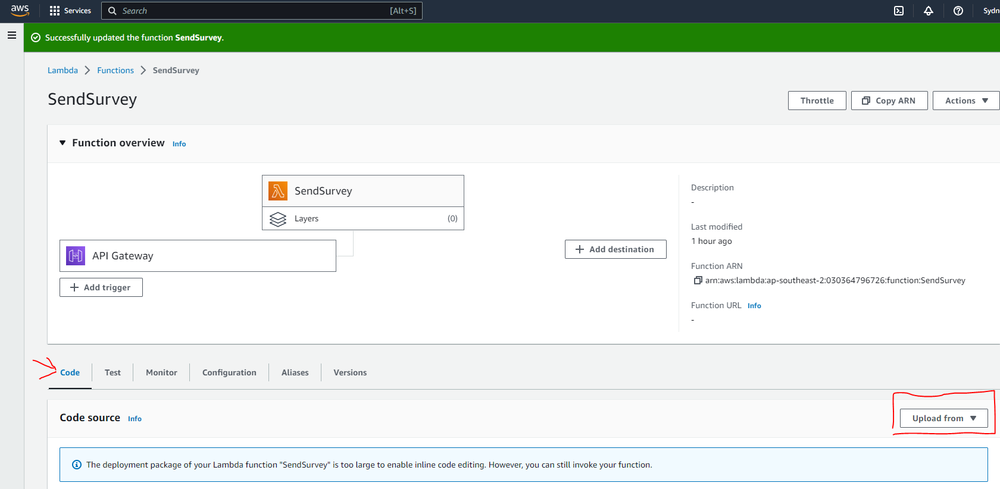

# AWS Lambda

## create a new api
[services > API Gateway](https://console.aws.amazon.com/apigateway/)

## set CORS

click into your API

at left side Develop > CORS

## upload code
```
pip install --target ./ google-auth google-auth-oauthlib google-auth-httplib2 google-api-python-client
```
and copy lambda_function.py, and your google key json to same folder

zip this folder and upload 


## other details
remember to handle preflight