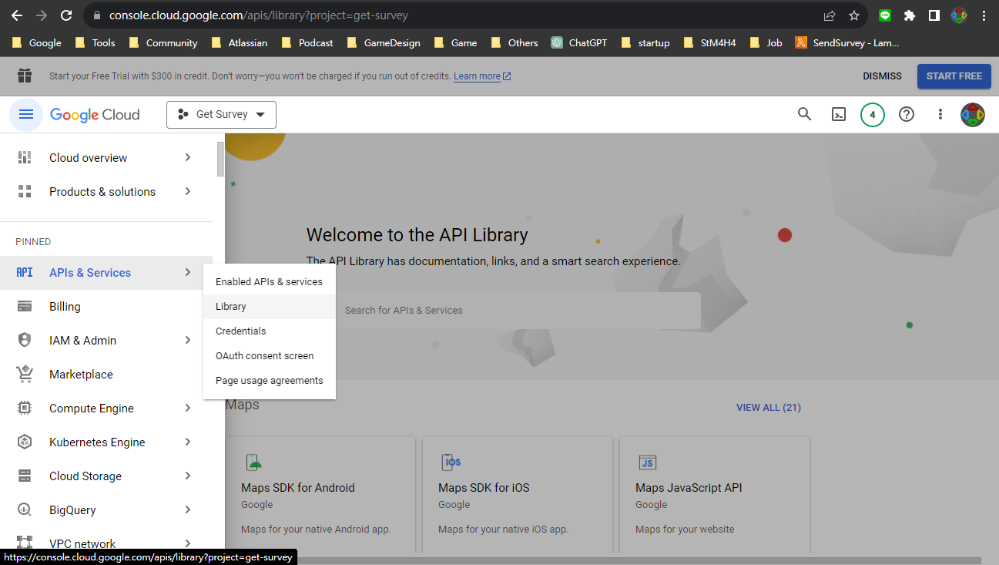
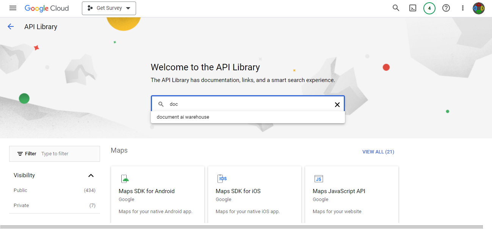
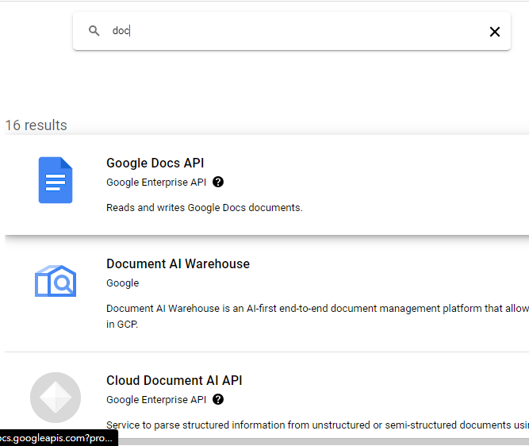
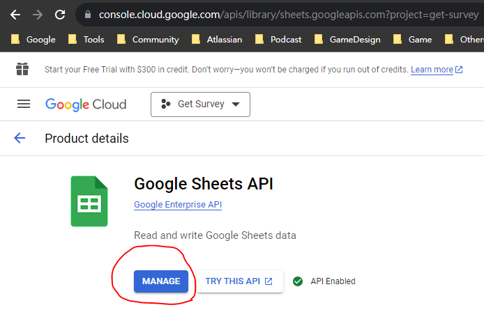
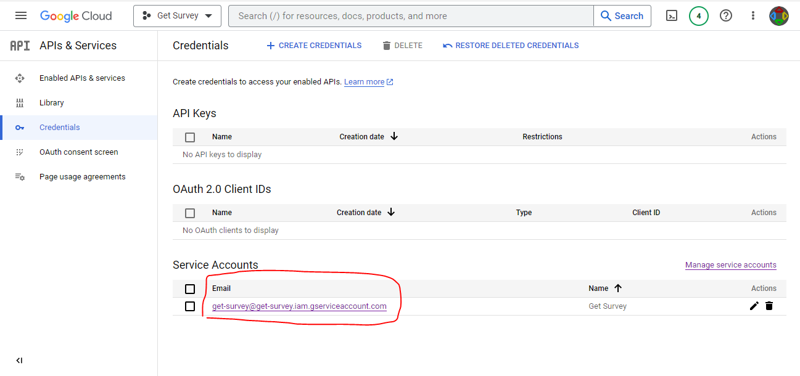
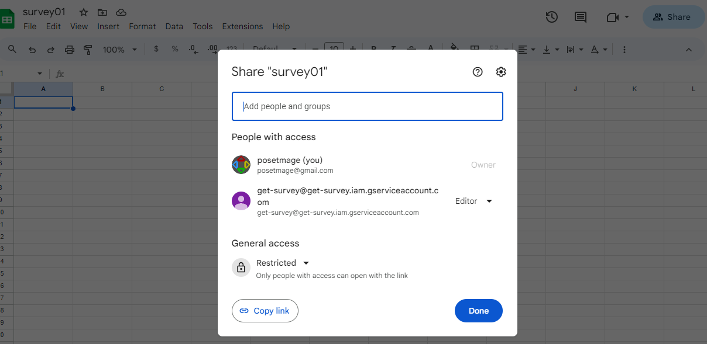
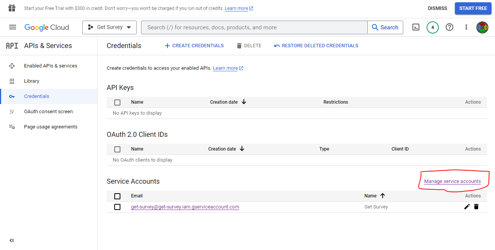
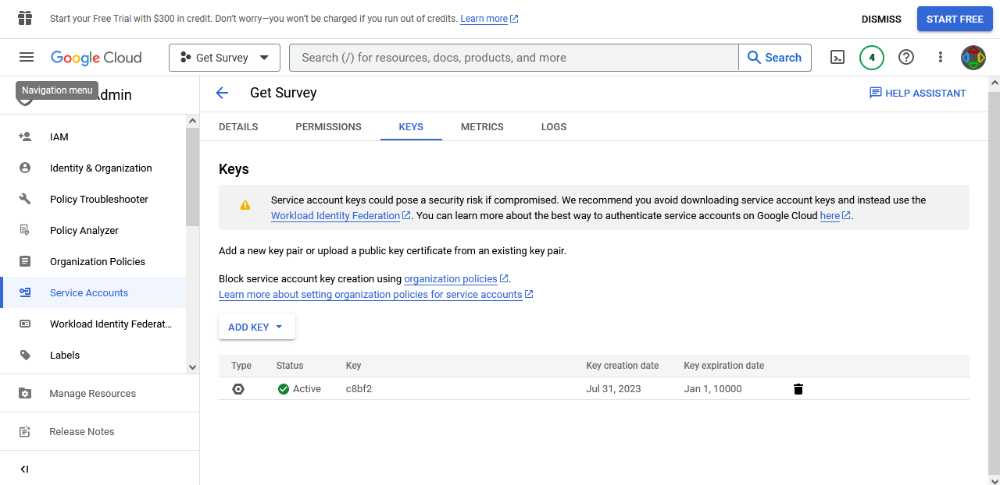

# Google API

## API Enable
enable doc, sheet,... apis for calling in future

[APIs > Library > ](https://console.cloud.google.com/apis/library/browse)

  
  
  
  

## Credential
create a new editor, this need to be add the file you want to call by api

[APIs > Credentials](https://console.cloud.google.com/apis/credentials)

  
  

## Download Token
go to your target
  

choose **ADD KEY**
  

then your keyfile.json will auto download
